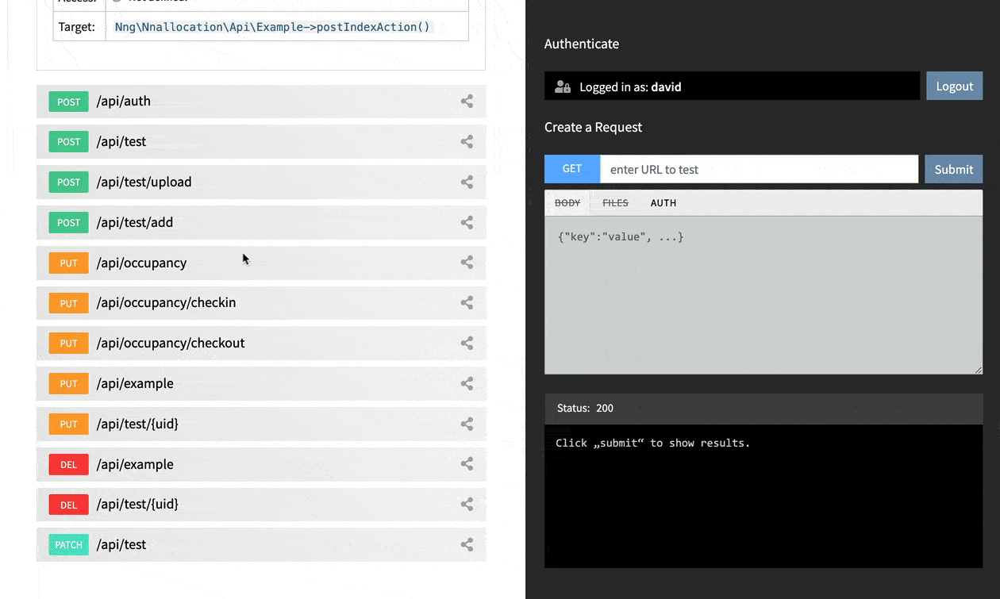
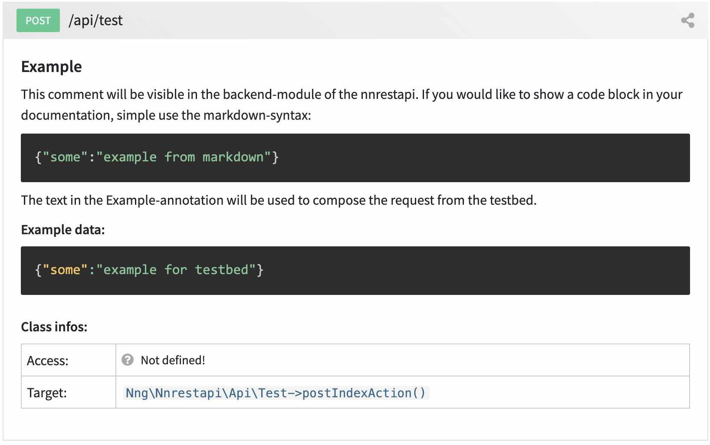

.. include:: ../Includes.txt

.. _annotations_example:

============
@Api\\Example
============

Add example data to your documentation
---------

The purpose of this annotation is to add example data to the automatically generated documentation
in the TYPO3 backend module of the ``nnrestapi`` that can be used for composing requests using
the testbed.

This annotation has no other function in the frontend. It is just to make working
with the backend-module easier: The extension comes shipped with a testbed to send
and test your REST Api requests directly in the backend module. The example data
will appear in the documentation and can be used to compose your request.



Example data for setting a string in the body:

.. code-block:: php

   @Api\Example("this is an example")


Example data for creating a JSON-request.

.. code-block:: php

   @Api\Example("{'username':'david', 'password':'mypassword'}")


Here is a full example:

.. code-block:: php

   <?php

   namespace My\Extension\Api;
   
   use Nng\Nnrestapi\Annotations as Api;

   class Example
   {
      /**
       * @Api\Example("this is an example")
       * @Api\Access("public")
       *
       * @return array
       */
      public function getAllAction() 
      {
         return ['nice'=>'result'];
      }

   }

Don't forget that you can always use `Markdown <https://www.markdownguide.org/cheat-sheet/>`__ 
in your documentation.

Here is an example:

.. code-block:: php

   /**
    * ## Example
    *
    * This comment will be visible in the backend-module of
    * the nnrestapi. If you would like to show a code block in
    * your documentation, simple use the markdown-syntax:
    * ```
    * {"some":"example from markdown"}
    * ```
    * The text in the Example-annotation will be used to compose
    * the request from the testbed.
    *
    * @Api\Example("{'some':'example for testbed'}")
    * @return array
    */

The above example would automatically create this documentation in the
backend module:

