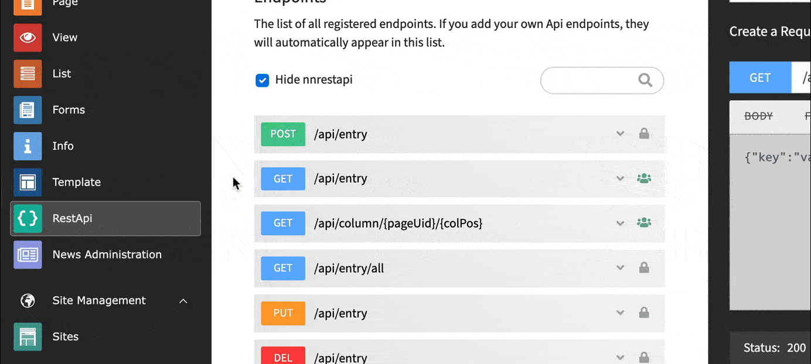

.. include:: ../Includes.txt

.. _annotations_example:

============
@Api\\Label
============

Add custom label to backend module
---------

This Annotation will override the default label that is used in the collapsible elements
of the RESTApi backend module. By default, the extension generates this label by evaluating
the :ref:`default <routing_standard>` or :ref:`custom <custom_routing>` routing.

This annotation has no other function in the frontend. It is just for modifying the 
view in the backend-module and making the labels of the endpoints better legible or
for handling edge cases.

|

**The syntax is:**

.. code-block:: php

   @Api\Label("this is my label!")

**Here is a full example:**

.. code-block:: php

   <?php

   namespace My\Extension\Api;
   
   use Nng\Nnrestapi\Annotations as Api;
   use Nng\Nnrestapi\Api\AbstractApi;

   /**
    * @Api\Endpoint()
    */   
   class Example extends AbstractApi
   {
      /**
       * @Api\Label("this is my label!")
       * @Api\Access("public")
       *
       * @return array
       */
      public function getAllAction() 
      {
         return ['nice'=>'result'];
      }

   }
