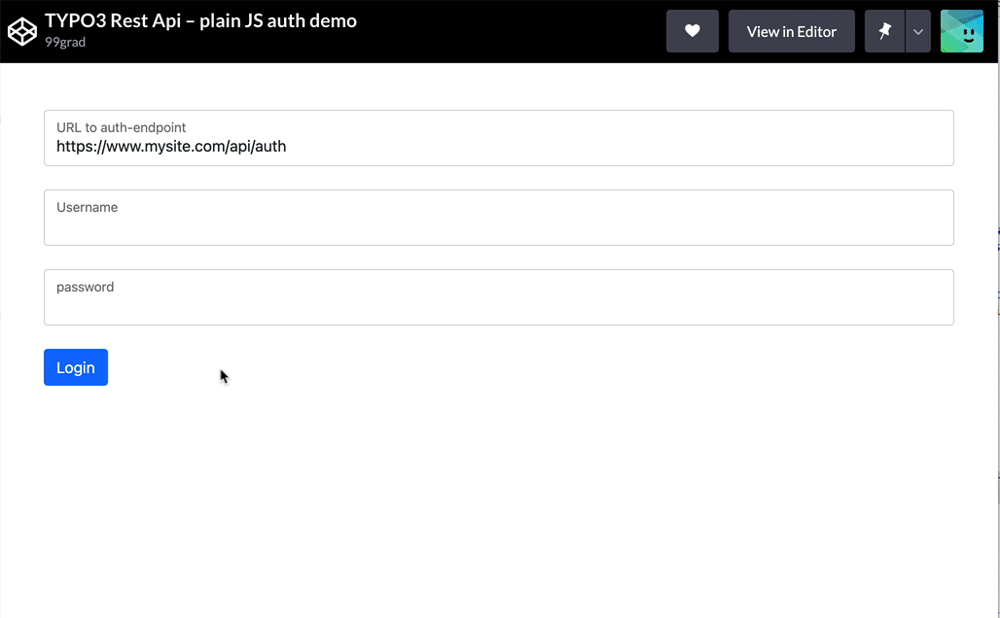

.. include:: ../Includes.txt

.. _authentication:

============
Authentication
============

Logging in as a Frontend-User with the TYPO3 RestApi
---------

The ``EXT:nnrestapi`` ships with an endpoint for logging in as a frontend-user (``fe_user``) and for checking the login-status
of the current user. 

**The TYPO3 Restful Api (nnrestapi) offers three different options for authenticating**:

- Authorization via :ref:`JSON Web Tokens (JWT) <authentication_jwt>`
- :ref:`Cookie-based Authorization <authentication_cookies>`. This uses the same ``fe_typo_user`` cookie that is set for "normal" Frontend-Users.
- :ref:`Basic Authorization via HTTP <authentication_http>`

Links and recipes
---------

To learn how to authenticate, dive in to one of the following recipes:

+------------------------------------------------------------------------+------------------------------------------------------------------------+
| Link to documentation                                                  | Content                                                                |
+========================================================================+========================================================================+
| :ref:`Configuring access right <access>`                               | Make sure, not anybody can access certain endpoints.                   |
|                                                                        | **Restrict access** to certain frontend-users or -groups.              |
+------------------------------------------------------------------------+------------------------------------------------------------------------+
| :ref:`Authentication via HTTP Basic Auth <authentication_http>`        | How to set username and password for individual users and as a global  |
|                                                                        | api-key for multiple users. The authentication will work using         |
|                                                                        | the HTTP Basic Authentication.                                         |
+------------------------------------------------------------------------+------------------------------------------------------------------------+
| :ref:`Frontend example, plain JS <examples_plain_auth>`                | Example fe_user-auth using nothing but pure JavaScript ("VanillaJS").  |
|                                                                        | Requires a **modern browser** that support ES6+ (anything but Internet |
|                                                                        | Explorer 11 and below)                                                 |
+------------------------------------------------------------------------+------------------------------------------------------------------------+
| :ref:`Frontend example, legacy JS <examples_legacy_auth>`              | Example fe_user-auth using nothing but pure JavaScript ("VanillaJS").  |
|                                                                        | Same like above, but for **older browsers** that can't use ``fetch()`` |
|                                                                        | (e.g. Internet Explorer 11 and below)                                  |
+------------------------------------------------------------------------+------------------------------------------------------------------------+
| :ref:`Frontend example with AXIOS <examples_axios_auth>`               | Pure JavaScript solution, but with a little help from the great JS     |
|                                                                        | library **"axios"** that makes life a little easier.                   |
+------------------------------------------------------------------------+------------------------------------------------------------------------+
| :ref:`Frontend example with jQuery <examples_jquery_auth>`             | If you still like **jQuery**, although the world is moving somewhere   |
|                                                                        | else, here is an example for the authentication using jQuery.          |
+------------------------------------------------------------------------+------------------------------------------------------------------------+

Full examples on CodePen
---------

Test your API and play with the code in our TYPO3 Rest Api CodePens:

|
| 
   
+------------------------------------------------------------------------+------------------------------------------------------------------------+
| Link to CodePen                                                        | Content                                                                |
+========================================================================+========================================================================+
| `Plain JS <https://codepen.io/99grad/full/zYEzMMg>`__                  | Authentication using **Pure JavaScript** (Vanilla JS) and ES6          |
+------------------------------------------------------------------------+------------------------------------------------------------------------+
| `Legacy JS <https://codepen.io/99grad/full/OJxgdye>`__                 | Authentication for **older Browsers** (IE11 and below)                 |
+------------------------------------------------------------------------+------------------------------------------------------------------------+
| `AXIOS <https://codepen.io/99grad/full/abLwJmm>`__                     | Authentication using **AXIOS**                                         |
+------------------------------------------------------------------------+------------------------------------------------------------------------+

.. toctree::
   :hidden:
   :glob:
   :maxdepth: 2

   Authentication/*