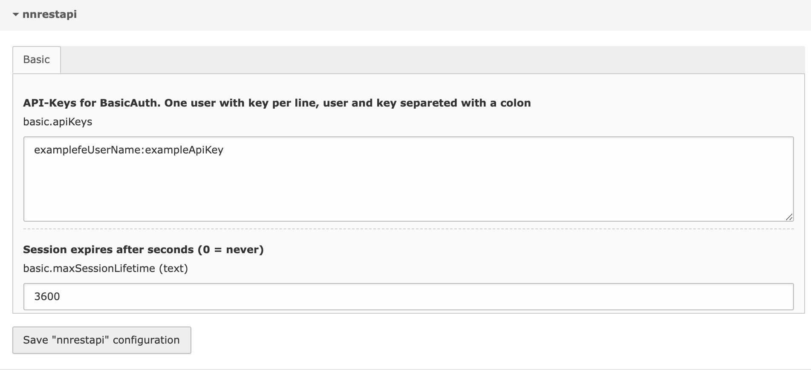

.. include:: ../Includes.txt

.. _configuration_extmanager:

============
Extension Manager Configuration
============

Configuring the TYPO3 Rest Api in the Extension Manager
-------------------------------

Use the backend module "Settings -> Extension Configuration" to modify the following settings: 

basic.apiKeys
""""""""""""""
.. container:: table-row

   Property
        basic.apiKeys
   Data type
        text
   Description
        List of global api users that can access the REST Api.
        One user per line. Username and ApiKey separated by a single colon (:)
        
        All usernames will work, except for the default "examplefeUserName".

        ::
          user1:theApiKeyOfUser1
          user2:theApiKeyOfUser2

   Default
        examplefeUserName:exampleApiKey

basic.maxSessionLifetime
""""""""""""""
.. container:: table-row

   Property
        basic.maxSessionLifetime
   Data type
        number
   Description
        Defines how long an inactive user stays logged in (seconds).

   Default
        3600