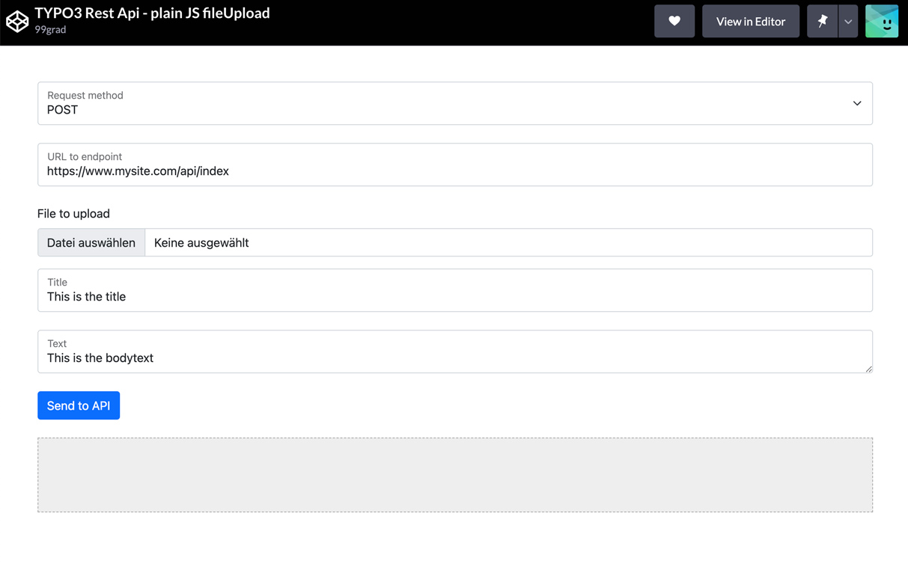

.. include:: ../Includes.txt

.. _fileupload:

============
File Uploads
============

Handling fileupload in your TYPO3 RestApi
---------

The ``EXT:nnrestapi`` makes uploading files and attaching them as SysFileReferences to Models as easy as possible.

To learn how to manage file-uploads, dive in to one of the following recipes:

+------------------------------------------------------------------------+------------------------------------------------------------------------+
| Link to documentation                                                  | Content                                                                |
+========================================================================+========================================================================+
| :ref:`Full example of creating a Rest Api<examples_article>`           | Describes step-by-step how to **setup your TYPO3 Restful Api**,        |
|                                                                        | including mapping of your JSON to a Model and attaching                |
|                                                                        | SysFileReferences (FAL)                                                |
+------------------------------------------------------------------------+------------------------------------------------------------------------+
| :ref:`Basics of JSON to FAL mapping <example_model_mapping>`           | Example of a **Model with a FileReference**. Show how to add and       |
|                                                                        | remove SysFileReferences with the API by passing the filepath or the   |
|                                                                        | special placeholder ``UPLOAD:/identifier``                             |
+------------------------------------------------------------------------+------------------------------------------------------------------------+
| :ref:`Configuring upload paths <annotations_upload>`                   | Control, **which folder** the uploaded files are moved to and how to   |
|                                                                        | write a script, that dynamically decides where the file should go.     |
+------------------------------------------------------------------------+------------------------------------------------------------------------+
| :ref:`Configuring access right <access>`                               | Make sure, not anybody can upload files to your server.                |
|                                                                        | **Restrict access** to certain frontend-users or -groups.              |
+------------------------------------------------------------------------+------------------------------------------------------------------------+
| :ref:`Frontend example, plain JS <examples_plain_fileuploads>`         | Full upload-example using nothing but pure JavaScript ("VanillaJS").   |
|                                                                        | Requires a **modern browser** that support ES6+ (anything but Internet |
|                                                                        | Explorer 11 and below)                                                 |
+------------------------------------------------------------------------+------------------------------------------------------------------------+
| :ref:`Frontend example, legacy JS <examples_legacy_fileuploads>`       | Full upload-example using nothing but pure JavaScript ("VanillaJS").   |
|                                                                        | Same like above, but for **older browsers** that can't use ``fetch()`` |
|                                                                        | (e.g. Internet Explorer 11 and below)                                  |
+------------------------------------------------------------------------+------------------------------------------------------------------------+
| :ref:`Frontend example with AXIOS <examples_axios_fileuploads>`        | Pure JavaScript solution, but with a little help from the great JS     |
|                                                                        | library **"axios"** that makes life a little easier.                   |
+------------------------------------------------------------------------+------------------------------------------------------------------------+
| :ref:`Frontend example with jQuery <examples_jquery_fileuploads>`      | If you still like **jQuery** althought the world is moving somewhere   |
|                                                                        | else, here is an example for the fileupload using jQuery.              |
+------------------------------------------------------------------------+------------------------------------------------------------------------+

Full examples on CodePen
---------

Test your API and play with the code in our TYPO3 Rest Api CodePens:

|
| 

+------------------------------------------------------------------------+------------------------------------------------------------------------+
| Link to CodePen                                                        | Content                                                                |
+========================================================================+========================================================================+
| `Plain JS <https://codepen.io/99grad/full/dyVRwbN>`__                  | File-upload using **Pure JavaScript** (Vanilla JS) and ES6             |
+------------------------------------------------------------------------+------------------------------------------------------------------------+
| `Legacy JS <https://codepen.io/99grad/full/VwMWNKW>`__                 | File-upload for **older Browsers** (IE11 and below)                    |
+------------------------------------------------------------------------+------------------------------------------------------------------------+
| `AXIOS <https://codepen.io/99grad/full/JjrJojb>`__                     | File-upload using **AXIOS**                                            |
+------------------------------------------------------------------------+------------------------------------------------------------------------+
| `jQuery <https://codepen.io/99grad/full/NWajXGm>`__                    | File-upload using **jQuery**                                           |
+------------------------------------------------------------------------+------------------------------------------------------------------------+
