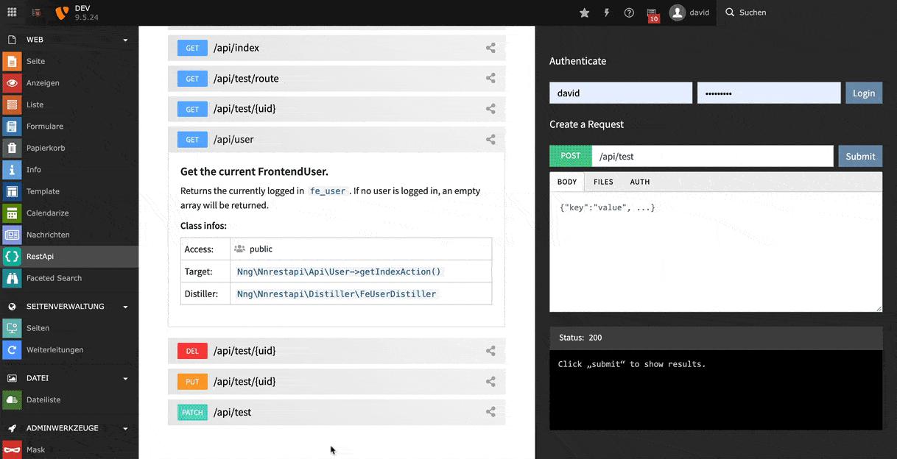

.. include:: ../Includes.txt

.. _screenshots:

====================
Screenshots
====================

Backend module with testbed
-----------------------------

While creating your own RestApi you don't need to use external tools like Postman.
All registered endpoints automatically get listed in the backend module. By clicking
on the compose-icon you can create your custom request in the backend including
Frontend-User authentication and file-uploading.

.. figure:: ../Images/01.gif
   :class: with-shadow
   :alt: nnrestapi Backend Module
   :width: 100%

Search and filter endpoints
-----------------------------

Search for registered endpoints in the backend and hide the default endpoints 
that come with the nnrestapi-extension.

Automatic documentation
-----------------------------

Use Markdown in your method annotations to automatically create the
documentation. This saves a lot of time and keeps code and
documentation at one place.

FrontendUser Authentication
-----------------------------

The ``nnrestapi`` extensions ships with a Authentication-layer for logging in frontend-users
and setting Json Web Tokens (JWT). This allows development from localhost-environments which
connect to a external development-server without CORS-problems.

You can test the login / logout from the testbed in the backend module:

FrontendUser Configuration
-----------------------------

Set an API-key for frontend users to authenticate using HTTP basic auth. Alternatively you 
can use JSON Web Tokens (JWT) or cookies. 

Setting the checkbox "admin mode" will allow the frontend user to retrieve hidden records with 
relations. This would usually only be able for backend users.

Extension Configuration
-----------------------------

Define API-keys for global users (no frontend-user necessary) that can authenticate using HTTP basic auth.
Set a session lifetime for your users - or create API-sessions that never expire.  

.. figure:: ../Images/ext-conf.jpg
   :class: with-shadow
   :alt: Extension Manager
   :width: 100%

CodePens to go wild on
-----------------------------

We've tried to give you as many practical examples for the frontend and backend as possible.
Most of the examples are also on CodePen for you to copy, test and modify.

.. figure:: ../Images/codepen-auth.gif
   :class: with-shadow
   :alt: nnrestapi example codepen
   :width: 100%

Walkthrough
-----------------------------

Overview of the installation and backend features of the extension.

.. youtube:: Za07kam3Odc
   :width: 100%