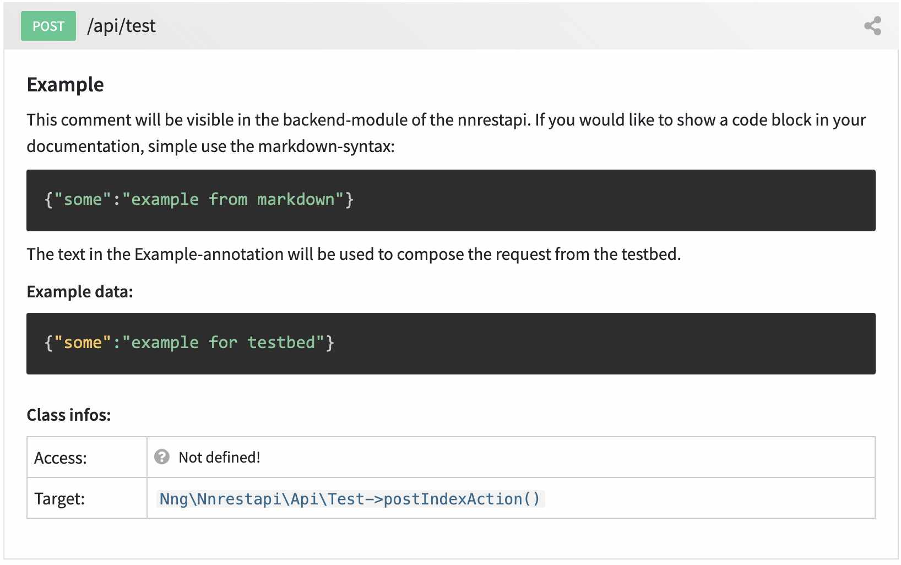

.. include:: ../Includes.txt

.. _access_writedocs:

============
Documenting your Api 
============

Use comments to create your documentation on-the-fly
---------

Creating a beautiful documentation of your TYPO3 RestApi is simple: No need to use
an external editor! Anything you write as a comment above your method will be
parsed and converted in a documenation that can be accessed in the TYPO3 backend.

In the comment you can even use `Markdown <https://www.markdownguide.org/cheat-sheet/>`__ to
format your text, add headings or example code blocks.

Here is an example:

.. code-block:: php

   /**
    * ## Example
    *
    * This comment will be visible in the backend-module of
    * the nnrestapi. If you would like to show a code block in
    * your documentation, simple use the markdown-syntax:
    * ```
    * {"some":"example from markdown"}
    * ```
    * The text in the Example-annotation will be used to compose
    * the request from the testbed.
    *
    * @Api\Example("{'some':'example for testbed'}")
    * @return array
    */

The above example would automatically create this documentation in the
backend module:

